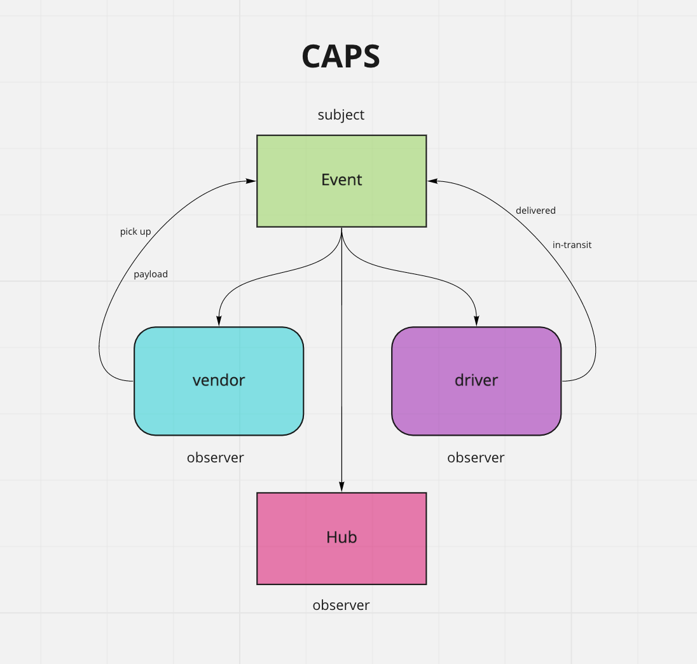

# caps

Created by Harvey Lucas and Roop Hayer

## Installation

```plaintext
> npm init -y
> npm install faker
```

## Summary of Problem Domain

### Lab: Class 11

Code Academy Parcel Service (CAPS)

Create a real-time service that allows for vendors, such as flower shops or restaurants, to alert a system of a package needing to be delivered, for drivers to instantly see what’s in their pickup queue, and then to alert the vendors as to the state of the deliveries (in transit, and then delivered).

### Phase 1 Requirements

In this first phase, our goal is to setup a system of events and handlers, with the intent being to change out the eventing system as we go, but keeping the handlers themselves largely the same. The task of “delivering a package” doesn’t change (the handler), even if the mechanism for triggering that task (the event) does.

## Visual


